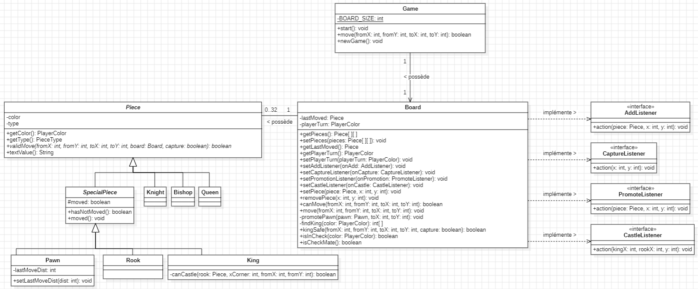

# Labo 8 - Jeu d'échecs

- Groupe : L08GrJ
- Etudiants : Calum Quinn, Dylan Ramos

## Diagramme de classes

## Choix d'implémentation

- La classe abstraite `SpecialPiece` regroupe les pièces ayant des intéractions avec d'autres pièces durant un de leur déplacement.
  - `Pawn` doit évaluer l'état d'un autre pion pour savoir s'il peut effectuer une capture "en passant".
  - `Rook` doit ne pas avoir bougé depuis le débût du jeu pour pouvoir effectuer un roque.
  - `King` doit être immobile depuis le débût de la partie pour pouvoir procéder à un roque.
- La position de chaque pièce est stockée en tant qu'index sur le plateau. Ceci à comme avantage de ne garder qu'une seule structure de données pour lister les pièces et les cases.
- La cardinalité de 0..32 sur `Piece` nous permet de créer un `Board` sans pièces et rappelle le nombre de pièces
    maximum dans un jeu d'échecs.
- Les interfaces `AddListener`, `CaptureListener`, `PromoteListener` et `CastleListener` ont été déclarées à l'intérieur de la classe `Board` pour mieux les encapsuler.
  Ces interfaces sont principalement utilisées pour appeler les méthodes de la classe `ChessView` sans avoir un lien direct entre la classe utilitaire `Board` et la classe de gestion `Game`.
- L'attribut `BOARD_SIZE` de `Board` est constant et permet de définir la taille du plateau de jeu qui est de 8x8. De plus,
  cet attribut est statique car il est commun à toutes les instances de `Board`.
- La classe abstraite `Piece` contient une methode `textValue` qui sert à rendre un String du nom de la pièce pour l'affichage graphique. Ceci permet notemment de proposer à l'utilisateur,
  les différents choix de promotion pour un pion.
- La classe `Pawn` à un attribut `lastMoveDist` pour savoir si un pion à bougé d'une ou deux cases lors de son déplacement précédent. 
  Ceci sert bien sûr à contrôler si une capture "en passant" et possible.
- La classe `Board` contient la méthode `isCheckMate` car, même si ce n'était pas demandé, c'est une des deux seuls façon de finir une partie d'échecs.
  L'autre manière étant le match nul, ce qui demande une analyse profonde de nombreux coups en avance pour prédire. 
  La méthode `isCheckMate` contrôle donc qu'il n'y a aucun déplacement d'aucune pièce qui puisse protéger le roi d'une attaque le coup suivant.